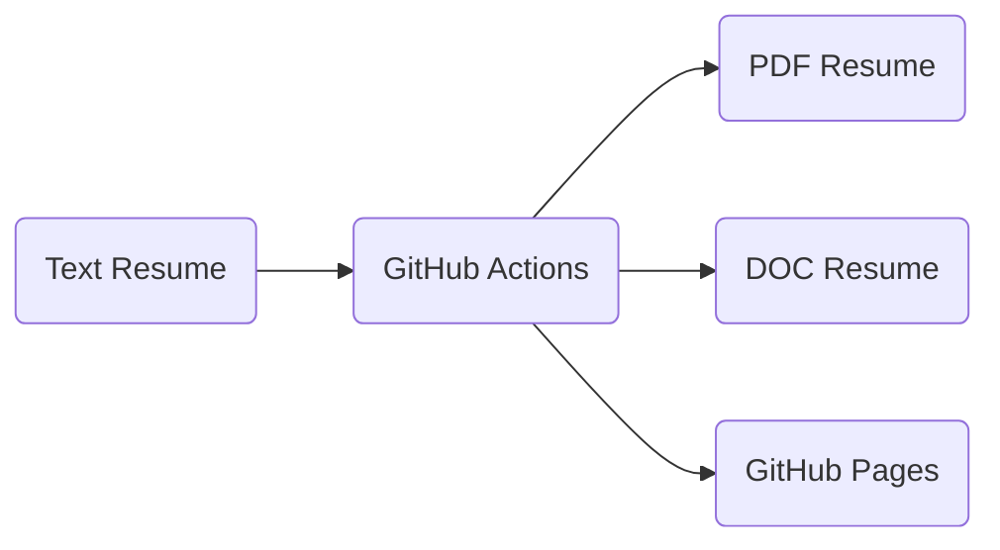

# Resume
How does a nerd approach a job search? With automation of course!

## Concept
We all know that managing your resume can be a pain. Not only the thoughtful writing that goes into your background, but also curating the look and feel so your resume is both professional and special. Then add in the fact that some companies will want a Word version, a PDF version, a text version, and your effort quickly explodes. The likelyhood of divergence or errors grows to unacceptable levels.

Part of my inspiration for this project was an opportunity to take advantage of GitHub Actions. For those unfamiliar (and to grossly oversimplify), GitHub Actions functions as a hosted Continuous Integration (CI) server. 

Knowing this, the idea just kind of draws itself:

### Failure: Markdown
So the idea was to start from a text representation that looks good when opened with any generic text editor, and as developers you know already the answer is Markdown. It provides a nicely-formatted option for pure text viewing, while knowing that a rendering tool can quickly convert it to HTML, as it does on GitHub itself. 

However, while doing the data entry, it quickly became apparent that I was developing against a schema. I am a person, I have 0..n jobs, I have a set of contact info, every job has a start and end date, etc. Markdown-first didn't feel right. 

### Success-ish: JSON Resume
I was not the first person in this predicament, and googling quickly surfaced [jsonresume.org](https://jsonresume.org/), which proposes a JSON schema for resumes. They also offer a rendering option, and have many available themes. There's only one problem... and it's JSON. It's just not that readable without some assistance, and has a lot of quirks around syntax. 

Deeper research surfaced several competing options/standards. However, there seems to be no current, up-to-date standard that has any traction. At this point, while I'll look at it as prior art, I won't be formally adopting JSON Resume. There's a middle ground between the explicity verbose structured data of JSON, and the implied-schema concerns of Markdown, and it's called YAML. 

### Success: YAML Resume
Where JSON fails for human readability, YAML can shine. In fact, expressing a resume in YAML feels very natural. It looks reasonably good, and is easily understood, in its textual representation

The only tricky part is rendering the YAML as HTML. From there, we then use a tool such as `pandoc` to export it to other formats.

## Data Entry
This is the boring part, and also the most time consuming. You can see the source document by clicking on the file named `resume.yml` in this repository.

## Rendering Testing

## Automation

## Conclusion
