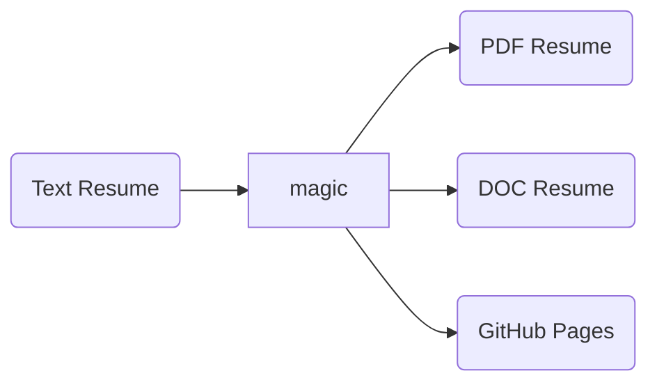

# Resume
How does a nerd approach a job search? With automation of course!

# From 2025
This resume worked well for a while, but it's time to upgrade. There's a host of issues in the current iteration: 

- Most critically, in the translation of Markdown to HTML to PDF, while the visual representation is largely accurate, I've found that many automated candidate tracking systems couldn't extract a useful resume from the PDF. Entire work items weren't present, headers appeared out of order or as part of a previous section, etc.
- The generated PDF isn't that pretty. I know in theory it doesn't matter, since getting through the automated filters is often the hardest part. But, I'd prefer to present myself as more than "slightly more than the bare minimum." I'm a premium product, right? The packaging deserves a bit more attention.
- The text, markdown, and HTML versions of the document, while interesting to me, were hardly ever used. I'm not sure anybody besides me ever saw them. I liked the idea of the quantity of nearly-identical documents that were automatically generated, but only the PDF version has been useful. 

If you're following my [connect four demo project](https://github.com/dustinbarnes/connect-four-demo), you'll know that I am personally trending away from hand-coding every bit, to taking advantage of the vast body of design work that's been published online.

## rendercv

Then, I found this tool called [rendercv](https://github.com/rendercv/rendercv). Here's a brief list of the highlights (for me): 

- Code against a YAML file (with schema definition in vscode!)
- Works on the premise of YAML -> [Typst](https://github.com/typst/typst) -> PDF. My previous iteration relied on headless chrome's print-to-pdf flag, which is functional but extremely limited. 
  - Typst is a LaTeX-like language for beautiful layouts, but is closer in syntax to Markdown.
  - I have no particular expertise in LaTeX, so I don't feel married to that standard. 
- Several off-the-shelf templates that look much better than my current layout


# From 2023

## Concept
We all know that managing your resume can be a pain. Not only the thoughtful writing that goes into your background, but also curating the look and feel so your resume is both professional and special. Then add in the fact that some companies will want a Word version, a PDF version, a text version, and your effort quickly explodes. The likelyhood of divergence or errors grows to unacceptable levels. 

Knowing this, the idea just kind of draws itself:



### Failure: Markdown
So the idea was to start from a text representation that looks good when opened with any generic text editor, and us developers already know the answer is Markdown. It provides a nicely-formatted option for pure text viewing, while knowing that a rendering tool can quickly convert it to HTML, as it does on GitHub itself. 

However, while doing the data entry, it quickly became apparent that I was developing against a schema. I am a person, I have 0..n jobs, I have a set of contact info, every job has a start and end date, etc. Markdown-first didn't feel right. 

### Success-ish: JSON Resume
I was not the first person in this predicament, and googling quickly surfaced [jsonresume.org](https://jsonresume.org/), which proposes a JSON schema for resumes. They also offer a rendering option, and have many available themes. There's only one problem... and it's JSON. It's just not that readable without some assistance, and has a lot of quirks around syntax. 

Deeper research surfaced several competing options/standards. However, there seems to be no current, up-to-date standard that has any traction. At this point, while I'll look at it as prior art, I won't be formally adopting JSON Resume. There's a middle ground between the explicity verbose structured data of JSON, and the implied-schema concerns of Markdown, and it's called YAML. 

### Success: YAML Resume
Where JSON fails for human readability, YAML can shine. In fact, expressing a resume in YAML feels very natural. It looks reasonably good, and is easily understood, in its textual representation

The only tricky part is rendering the YAML as HTML. From there, we then use a tool such as `pandoc` to export it to other formats.

## Data Entry
This is the boring part, and also the most time consuming. You can see the source document by clicking on the file named `resume.yml` in this repository.

## Rendering
Now it's time to do something with the YAML. My first target will be, ironically enough, Markdown. For the same reason it was considered initially as the source, it's possible to render basic markdown and have it look reasonably good with little fuss. To do this, I need a way to render a file output. Having previous experience with Handlebars, I just jumped to that tool. 

To test something dead simple, I created `test.markdown.ms`, and gave it a very straightforward template:

```
{{contact.name}}

{{contact.summary}}
```

And then ran it:

```
[16:25:29] dustin in ~/ws/resume on main [?]
$ hb -i ./resume.yml -t test.markdown.hbs -s true
Dustin Barnes

A 20+ year Software Development veteran with deep and broad experience
in software development, cloud adoption, and CI/CD process. Multiple 
successful migrations to the cloud (AWS and GCP), and onto container
technologies like Kubernetes.
```

Note: the `hb` tool is installed with: `npm install https://github.com/RealOrko/nodejs-handlebars-cli.git -g`

From there, I applied basic formatting and now there's a rendering at [`rendered/resume.md`](https://github.com/dustinbarnes/resume/blob/main/rendered/resume.md). It is, rather unsurprisingly, a nice rendering. 


## Automation

## Conclusion
