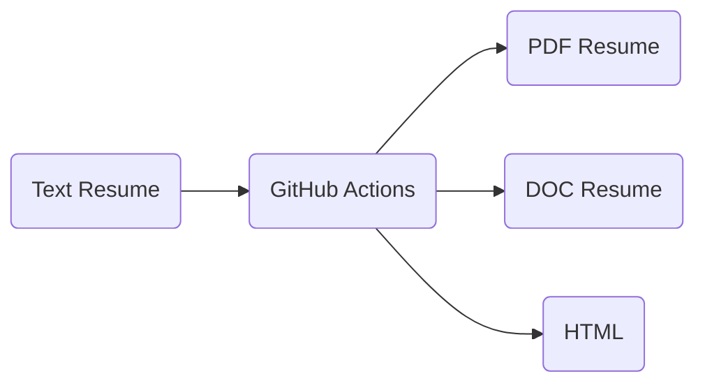

# Resume
How does a nerd approach a job search? With automation of course!

## Concept
We all know that managing your resume can be a pain. Not only the thoughtful writing that goes into your background, but also curating the look and feel so your resume is both professional and special. Then add in the fact that some companies will want a Word version, a PDF version, a text version, and your effort quickly explodes. The likelyhood of divergence or errors grows to unacceptable levels.

So the idea is to start from a text representation that looks good when opened with any generic text editor, and as developers you know already the answer is Markdown. It provides a nicely-formatted option for pure text viewing, while knowing that a rendering tool can quickly convert it to HTML, as it does on GitHub itself. 

Part of my inspiration for this project was an opportunity to take advantage of GitHub Actions. For those unfamiliar (and to grossly oversimplify), GitHub Actions functions as a hosted Continuous Integration (CI) server. 

Knowing this, the idea just kind of draws itself:

> :diamond_shape_with_a_dot_inside: Tip: Check out the source code of the `README.md` file, that graphic is generated on the fly!

